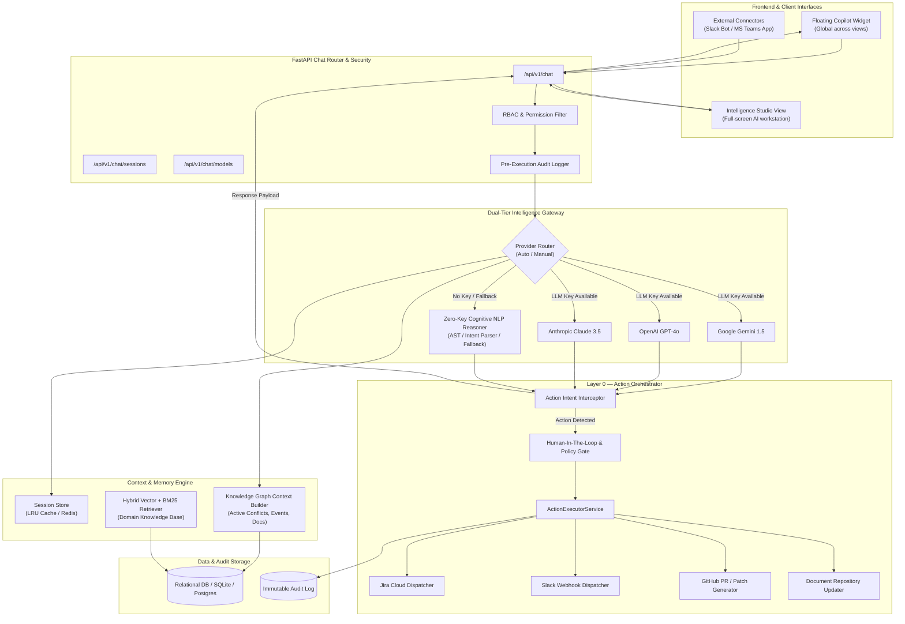
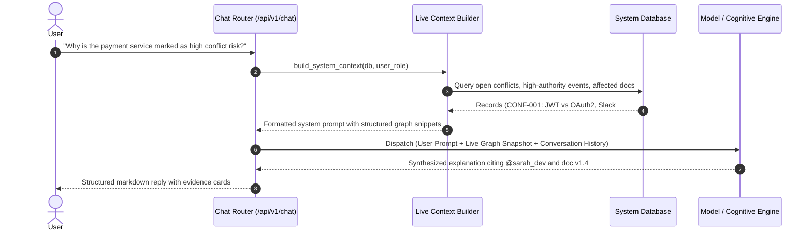
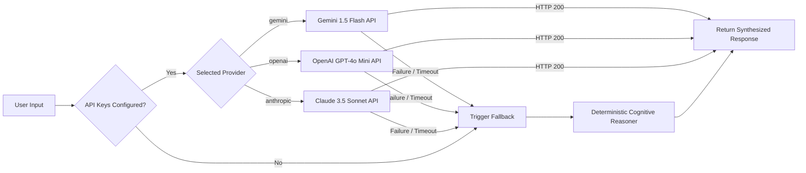
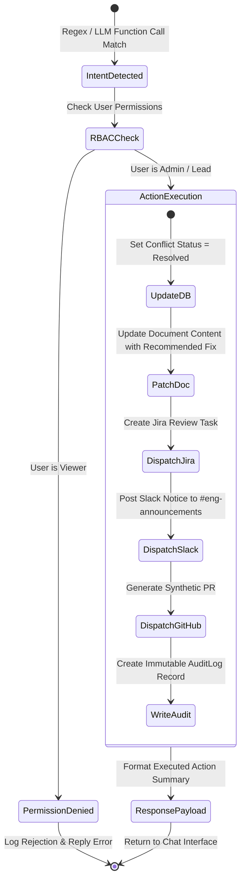
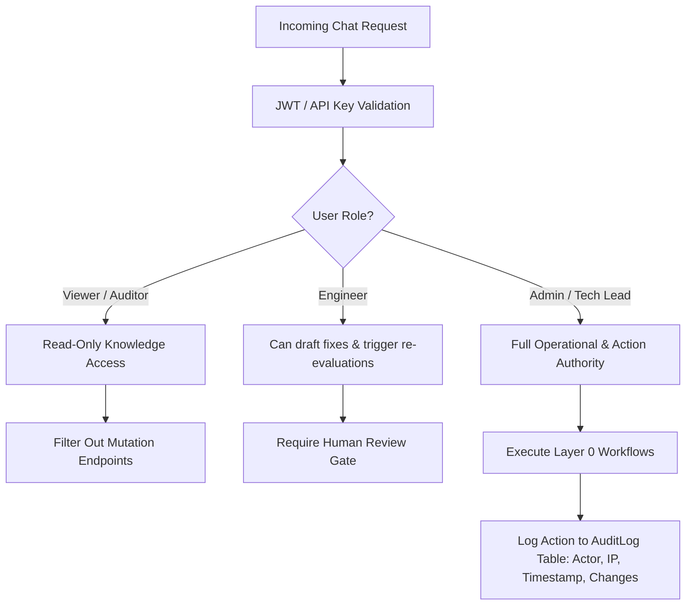

# Company Brain OS — Chatbot & AI Copilot Architecture
**Document Version:** 2.0  
**Target System:** Central OS Brain (Self-Healing Enterprise Knowledge & Action Platform)  
**Status:** Approved Architectural Blueprint  

---

## 1. Executive Summary & Vision

The **Company Brain OS Chatbot** is a conversational copilot and autonomous action orchestrator designed to operate at the center of the self-healing knowledge ecosystem. Rather than functioning as an isolated Q&A bot, it operates as a **Chief Intelligence Officer (CIO) Agent** that has direct situational awareness across all 5 operational layers of the enterprise:

```
┌──────────────────────────────────────────────────────────────┐
│                  Central OS Brain Hierarchy                  │
├──────────────────────────────────────────────────────────────┤
│ Layer 4: Ingestion Bus (Slack, GitHub, Jira, Teams, Notion)  │
│ Layer 3: Knowledge Normalization & Pipeline Engine           │
│ Layer 2: Conflict Detection & Evidence Intelligence          │
│ Layer 1: Relational & Vector Data Store (Postgres / SQLite)   │
│ Layer 0: Workflow Execution & Enterprise Dispatchers         │
└──────────────────────────────────────────────────────────────┘
```

### Core Value Propositions
1. **Live Grounded Context**: Every query is evaluated against real-time operational events, contradictory claims, and official documentation snapshots.
2. **Dual-Mode Intelligence**: 
   - **External LLM Mode**: High-reasoning foundation models (Gemini 1.5 Flash, GPT-4o, Claude 3.5 Sonnet).
   - **Zero-Key Cognitive Engine**: Built-in heuristic NLP reasoner ensuring 100% uptime with zero external API dependencies.
3. **Conversational Action Execution (Layer 0)**: Capable of parsing administrative and operational intents (e.g., *"Approve conflict CONF-001 and patch the payment doc"*), enforcing RBAC guardrails, and triggering external webhooks across Jira, Slack, and GitHub.
4. **Transparent Source Attribution**: Responses link back to specific authors, timestamps, document paragraphs, and conflict records.

---

## 2. High-Level System Architecture



---

## 3. Subsystem Breakdown & Deep-Dive

### 3.1 Live Grounding & Context Subsystem
The chatbot avoids hallucinations by binding the active conversation to a live snapshot of the enterprise graph.



#### Context Window Hierarchy:
1. **Persona & Execution Directives** (Fixed ~300 tokens): Role definitions, action triggers, formatting rules.
2. **Conflict Inbox Snapshot** (Dynamic ~800 tokens): Top open contradictions, severity levels, contradiction scores, and evidence links.
3. **High-Authority Event Stream** (Dynamic ~600 tokens): Recent messages/PRs from verified engineering leads and architects.
4. **Document Registry Meta** (Dynamic ~400 tokens): Official document status, owners, freshness timestamps.
5. **Conversation Session History** (Sliding window ~1200 tokens): Last 8 turns of user-bot dialogue.

---

### 3.2 Dual-Tier Intelligence Gateway

The architecture features a hybrid execution pattern:



#### The Zero-Key Cognitive Reasoner Pipeline
When operating offline or without external LLM API tokens, the `NLPChatEngine` runs an internal 5-stage deterministic pipeline:
1. **Lexical & Intent Parser**: Regex and AST pattern matching for explicit operational directives (*approve, reject, reassign, status, compare, diff*).
2. **Entity & Conflict Resolver**: Resolves target conflict IDs (e.g. `CONF-001`, `auth`, `payment`) against live DB records.
3. **Causal & Comparative Analyzer**: Computes time-deltas, freshness disparities, and authority differentials.
4. **Template & Evidence Formatter**: Generates rich GitHub-flavored markdown with structured tables and impact metrics.
5. **Action Dispatch Trigger**: Emits structured mutations into the Layer 0 Action Executor.

---

### 3.3 Autonomous Action Execution Subsystem (Layer 0)

When a user issues an action command via natural language (e.g., *"Approve the OAuth2 update and open a Jira task"*), the system executes a safe, atomic workflow:



#### Action Capabilities Matrix:
| Command Intent | Triggers | Layer 0 Workflow Actions | Output Artifacts |
|---|---|---|---|
| **Approve Conflict** | `approve <id>`, `accept recommended fix` | Mark conflict approved, update doc repository | Jira ticket, Slack alert, GitHub PR, Audit record |
| **Reject Conflict** | `reject <id> [reason]`, `dismiss conflict` | Mark conflict rejected, record explanation | Audit record, Slack dismissal note |
| **Reopen / Reassess** | `reopen <id>`, `re-evaluate` | Set status to open, trigger re-scoring | Audit log, re-indexing event |
| **Reassign Owner** | `assign <id> to <user>` | Update conflict owner, notify assignee | Slack direct notification, Audit log |
| **Simulate Conflict** | `simulate new event`, `ingest event` | Run Layer 2 Conflict Detector | New conflict entry, Event bus record |

---

### 3.4 Session & Memory Management Subsystem

To maintain conversational coherence without memory bloat:

```
┌───────────────────────────────────────────────────────────┐
│               Session Store (LRU Architecture)            │
├───────────────────────────────────────────────────────────┤
│ Max Concurrent Sessions: 200                              │
│ Idle Eviction TTL: 6 Hours                                │
│ Max Messages Per Session: 500 (Sliding Context Window = 8)│
│                                                           │
│ Key: session_id (UUID v4)                                 │
│ Value: {                                                  │
│   title: "Payment Auth Migration Discussion",             │
│   created_at: "2026-08-15T00:30:00Z",                     │
│   last_active: "2026-08-15T00:38:15Z",                    │
│   history: [ {role: "user"|"bot", text, timestamp}, ... ] │
│ }                                                         │
└───────────────────────────────────────────────────────────┘
```

---

## 4. Security, RBAC & Compliance Framework



### Safety & Guardrail Rules:
1. **Human-in-the-Loop Safeguard**: Automated updates to production documentation require explicit approval tokens or human role authentication.
2. **Audit Immutability**: Every action executed via the chatbot creates a cryptographically timestamped record in `AuditLog`.
3. **Data Scrubbing**: API keys, credentials, and PII in chat context are masked before being transmitted to external LLM providers.

---

## 5. API Interface Specifications

### 5.1 Send Message Endpoint
- **URL**: `POST /api/v1/chat`
- **Request Body**:
```json
{
  "message": "Approve the JWT to OAuth2 conflict and notify the backend channel",
  "session_id": "8f3b2029-79d2-43bb-9236-ecf0525287f3",
  "provider": "auto",
  "model": "gemini-1.5-flash",
  "api_key": null
}
```
- **Response Payload**:
```json
{
  "reply": "### ✅ Conflict Approved & Workflows Dispatched\n\nI have approved **CONF-001: Payment Service Auth Mismatch** and executed the following Layer 0 workflows:\n\n- 📄 **Document Updated**: `Payment Service Architecture (DOC-001)` patched to OAuth2.\n- 🎯 **Jira Task Created**: `PROJ-8821` assigned to `@sarah_dev`.\n- 💬 **Slack Alert**: Posted to `#dev-backend`.\n- 🐙 **GitHub PR**: Created `PR #104` with updated auth middleware documentation.\n- 🛡️ **Audit Record**: Logged under action `APPROVE_CONFLICT`.",
  "engine": "gemini-1.5-flash",
  "session_id": "8f3b2029-79d2-43bb-9236-ecf0525287f3",
  "title": "Payment Auth Migration Discussion",
  "message_count": 4,
  "timestamp": "2026-08-15T00:38:20.124Z",
  "sources": ["conflicts", "events", "workflows", "audit_logs", "agents"]
}
```

### 5.2 Session Management Endpoints
- `GET /api/v1/chat/sessions` — List all active conversation threads with previews.
- `POST /api/v1/chat/sessions/new` — Create a new named conversation thread.
- `GET /api/v1/chat/session/{session_id}` — Retrieve complete chat history for a session.
- `PATCH /api/v1/chat/session/{session_id}` — Rename a session title.
- `DELETE /api/v1/chat/session/{session_id}` — Flush session from server memory.
- `GET /api/v1/chat/models` — Query status and availability of LLM providers.

---

## 6. Frontend Integration Architecture

The frontend provides two complementary conversational access points:

```
┌────────────────────────────────────────────────────────────────────────┐
│                        Frontend Architecture                           │
├────────────────────────────────────────────────────────────────────────┤
│                                                                        │
│   ┌────────────────────────────────┐  ┌────────────────────────────┐  │
│   │ Floating Chat Copilot Widget   │  │ Intelligence Studio View   │  │
│   ├────────────────────────────────┤  ├────────────────────────────┤  │
│   │ • Quick-access floating pill   │  │ • Full-screen split layout │  │
│   │ • Overlay across all views     │  │ • Multi-session sidebar    │  │
│   │ • Fast context questions       │  │ • Model selection toggle   │  │
│   │ • 1-click action triggers      │  │ • Rich evidence diff viewer│  │
│   │ • Auto-refresh parent views    │  │ • Export conversation JSON │  │
│   └────────────────────────────────┘  └────────────────────────────┘  │
│                                  │                                     │
│                                  ▼                                     │
│                     Shared API Service Layer                           │
│                (apiService.sendChatMessage)                            │
└────────────────────────────────────────────────────────────────────────┘
```

---

## 7. Performance, Reliability & Scalability Metrics

| Metric | Target SLA | Architecture Mechanism |
|---|---|---|
| **Zero-Key Cognitive Response Time** | < 25ms | Pure in-memory AST pattern matching & compiled regex |
| **External LLM Response Time** | < 1200ms | Async `httpx.AsyncClient` with tight 18s timeouts |
| **Context Window Assembly** | < 10ms | Optimized SQLAlchemy joins with limit caps |
| **Session Lookup Latency** | < 1ms | O(1) Python `OrderedDict` memory hash map |
| **Concurrent Active Sessions** | 200 (in-memory) -> 100k (Redis cluster in Prod) | LRU eviction + horizontal session partitioning |
| **System Uptime** | 99.99% | Automatic graceful degradation to Cognitive Engine |

---

## 8. Summary & Next Steps Roadmap

1. **Phase 1 (Completed)**: In-memory session store, live system context grounding, multi-model gateway (Gemini/OpenAI/Claude), Zero-Key Cognitive fallback engine, Layer 0 action interception.
2. **Phase 2 (Immediate)**: Server-Sent Events (SSE) streaming for real-time token rendering, Redis-backed persistent session store.
3. **Phase 3 (Production Enterprise)**: pgvector dense semantic retrieval on enterprise document chunks, multi-agent debate synthesis for high-risk conflict resolutions.
