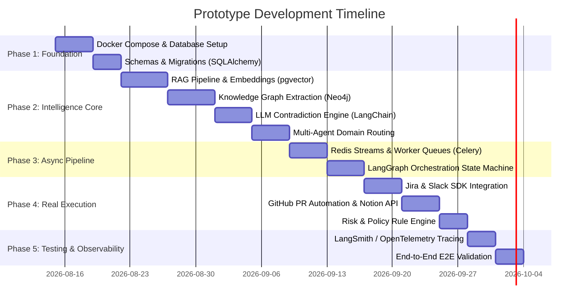

# Company Brain OS — MVP to Prototype Engineering Roadmap

This document outlines the step-by-step technical plan to evolve the **Company Brain OS** MVP (in-memory fixtures, simulated execution) into a **working functional Prototype** with real databases, LLM-driven intelligence, asynchronous pipelines, and actual third-party API integrations.

---

## 1. Architecture Transition Overview

```
┌─────────────────────────────────────────────────────────────────────────────┐
│                             MVP (Current)                                   │
├───────────────────────┬─────────────────────────────────────────────────────┤
│ Storage & Foundation  │ In-memory Python dictionaries + JSON files          │
│ Conflict Detection    │ Deterministic heuristic & hardcoded metadata match  │
│ Multi-Agent System    │ Static agent state profiles                         │
│ Processing Pipeline   │ Synchronous in-memory request-response              │
│ Execution Engine      │ Mocked JSON action generator                        │
│ External Integrations │ Simulated Slack, Jira, GitHub outputs               │
└───────────────────────┴─────────────────────────────────────────────────────┘
                                      │
                                      ▼
┌─────────────────────────────────────────────────────────────────────────────┐
│                         Functional Prototype (Target)                       │
├───────────────────────┬─────────────────────────────────────────────────────┤
│ Storage (Layer 1)     │ PostgreSQL + pgvector, Neo4j, Redis, MinIO (Docker) │
│ Intelligence (Layer 2)│ Chunking + OpenAI/Gemini Embeddings + Neo4j Graph   │
│                       │ + LLM Contradiction Reasoning (NLI/Structured JSON) │
│ Pipeline (Layer 3)    │ Redis Streams + Celery / Arq + LangGraph Workflows  │
│ Execution (Layer 0)   │ Real Slack Bot, GitHub Octokit PRs, Jira REST API   │
│ Ingestion (Layer 4-5) │ FastAPI webhook receivers & OAuth connectors        │
└─────────────────────────────────────────────────────────────────────────────┘
```

---

## 2. Phase-by-Phase Prototype Roadmap



---

### Phase 1: Local Infrastructure & Data Foundation (Layer 1)
**Goal:** Replace mock JSON files with live containerized data services.

1. **Docker Compose Setup (`docker-compose.yml`):**
   * **PostgreSQL 16 + pgvector**: Relational storage for documents, events, conflicts, and audit logs; vector storage for chunk embeddings.
   * **Neo4j 5.x**: Entity-relationship graph (Documents $\leftrightarrow$ Concepts $\leftrightarrow$ Teams $\leftrightarrow$ Events).
   * **Redis 7.x**: Ingestion stream queues and transient response caching.
   * **MinIO / Local S3**: Raw document binary storage (PDFs, Markdown, images).
2. **Database Modeling & Migrations:**
   * Implement models using **SQLAlchemy 2.0** / **SQLModel** and manage migrations with **Alembic**.
   * Define indexes on metadata (authorities, freshness timestamps, domain tags, HNSW vector index for embeddings).

---

### Phase 2: Intelligence Core & Knowledge Engine (Layer 2)
**Goal:** Transition from hardcoded rules to dynamic semantic retrieval, knowledge graph traversal, and LLM-driven contradiction detection.

1. **Semantic Ingestion & RAG Pipeline:**
   * **Chunking**: Markdown/Document aware chunking (500–1000 tokens with 10% overlap).
   * **Embedding Generation**: Utilize `text-embedding-3-small` (1536 dims) or local `bge-large-en-v1.5`.
   * **Hybrid Retrieval**: Combine PostgreSQL full-text search (`tsvector`) + pgvector cosine similarity, followed by a cross-encoder re-ranker (`Cohere Rerank` or `bge-reranker`).
2. **Knowledge Graph Modeling (Neo4j):**
   * Automatically extract Entities, Decisions, and Dependencies from ingested texts.
   * Create Cypher queries to discover multi-hop drift:
     $$\text{(Service:Payment)} \xrightarrow{\text{DEFINED\_BY}} \text{(Doc:Architecture)} \xrightarrow{\text{CONTRADICTED\_BY}} \text{(Event:SlackHuddle)}$$
3. **LLM Contradiction Detection Engine:**
   * Formulate prompt templates with few-shot examples for Natural Language Inference (NLI):
     * Premise: Official Documentation snippet.
     * Hypothesis: New Operational Event snippet.
     * Evaluation: `Contradiction | Entailment | Neutral`.
   * Enforce **Pydantic Structured Output** to return:
     * `contradiction_score: float` (0.0 to 1.0)
     * `reasoning: str`
     * `proposed_diff: str` (Unified Diff / Patch)
     * `affected_systems: list[str]`
4. **Multi-Agent Specialization:**
   * **Engineering Agent**: Specializes in API specs, code PRs, architectural decisions.
   * **Finance/Legal Agent**: Specializes in SLAs, compliance rules, pricing docs.
   * **Sales/Ops Agent**: Specializes in SOPs, customer onboarding, team ownership.

---

### Phase 3: Processing & Orchestration Pipeline (Layer 3)
**Goal:** Build an asynchronous event-driven ingestion and evaluation pipeline.

1. **Event Ingestion Queue (Redis Streams + Celery / Arq):**
   * Ingest raw webhook payloads asynchronously without blocking HTTP gateways.
   * Workers normalize raw data into unified `CompanyEvent` schemas.
2. **LangGraph Pipeline Orchestrator:**
   * Define cyclical state machines for conflict evaluation:
     $$\text{Normalize} \to \text{RAG Hybrid Search} \to \text{Graph Lookup} \to \text{Agent Evaluation} \to \text{Risk Policy Gate}$$
   * Maintain state persistence using LangGraph checkpointing.

---

### Phase 4: Real Execution Engine & Policy Matrix (Layer 0)
**Goal:** Connect approval actions to actual external enterprise platforms.

1. **Third-Party API Connectors:**
   * **GitHub**: Use PyGithub / GitHub REST API to automatically branch, apply the Markdown patch, and open a PR with evidence links.
   * **Slack**: Use `@slack/bolt` or `slack-sdk` to send Block Kit interactive cards to designated channels/owners.
   * **Jira**: Use Jira REST API v3 to generate tracking tickets assigned to the document owner.
   * **Notion / Confluence**: Patch official document blocks via Notion API / Confluence REST API upon final human sign-off.
2. **Risk & Policy Engine:**
   * Integrate rule validation matrix (Open Policy Agent `OPA` or custom Python rule engine) evaluating:
     * Authority score thresholds.
     * Required reviewer roles (e.g., Lead Architect for Sev1 docs).
     * Mandatory legal checks for external SOPs.

---

### Phase 5: Production Readiness & Observability
**Goal:** Ensure enterprise-grade reliability, security, and auditability.

1. **LLM Tracing & Observability:**
   * Instrument with **LangSmith**, **Phoenix (Arize)**, or **OpenTelemetry** to trace token costs, latency, and LLM reasoning steps.
2. **RAG Evaluation (Ragas / TruLens):**
   * Continuously evaluate:
     * *Faithfulness*: Does the suggested fix stick strictly to evidence?
     * *Answer Relevance*: Does the update resolve the contradiction?
     * *Context Precision*: Did RAG pull the exact conflicting document?

---

## 3. Technology Stack Comparison

| Component | MVP (Current) | Prototype (Target) |
| :--- | :--- | :--- |
| **Backend API** | Python `ThreadingHTTPServer` | **FastAPI + Pydantic v2 + Uvicorn** |
| **Relational DB** | In-Memory JSON | **PostgreSQL 16** |
| **Vector DB** | Mocked in memory | **pgvector (PostgreSQL extension)** |
| **Graph DB** | Simulated metadata | **Neo4j Community Edition** |
| **Queue / Event Bus** | Simulated in memory | **Redis Streams + Celery / Arq** |
| **Orchestration** | Procedural script | **LangGraph / LangChain** |
| **LLM & Embeddings** | Deterministic formulas | **OpenAI (`gpt-4o` / `text-embedding-3-small`)** |
| **Integrations** | Static dummy outputs | **Slack SDK, PyGithub, Jira REST, Notion API** |
| **Frontend** | Vanilla JS / CSS | **Next.js (React 18) + Tailwind CSS + Lucide Icons** |

---

## 4. Immediate Next Steps to Begin Prototype

1. **Step 1:** Create `docker-compose.yml` with PostgreSQL (pgvector), Neo4j, and Redis.
2. **Step 2:** Refactor `backend/app.py` into a modular FastAPI project structure:
   ```text
   backend/
   ├── api/          # Routers (health, conflicts, agents, workflows)
   ├── core/         # Config, security, database connections
   ├── models/       # SQLAlchemy & Pydantic schemas
   ├── services/     # RAG, Graph, Conflict Engine, Multi-Agent logic
   ├── workers/      # Celery / Redis queue workers
   └── main.py       # FastAPI application factory
   ```
3. **Step 3:** Implement live OpenAI/Gemini API calls with structured Pydantic output in `services/conflict_detector.py`.
4. **Step 4:** Configure a test Slack Webhook and GitHub Personal Access Token (PAT) to demonstrate a real PR and real Slack alert creation on approval.
